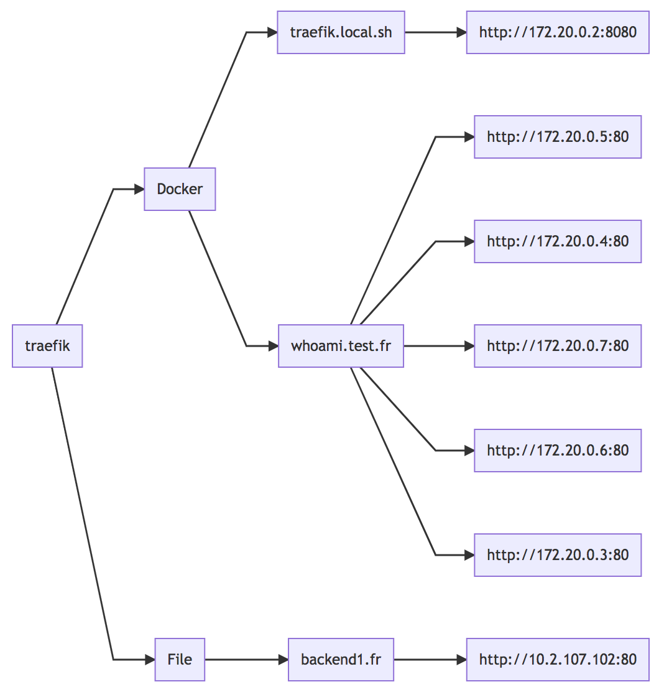

# traefik-mermaid [](http://github.com/badges/stability-badges)

A react component that renders your traefik network in real-time using [mermaidjs](https://mermaidjs.github.io)

## Usage

Add CORS support to your traefik API :

Example using docker labels :

```sh
traefik.frontend.headers.customResponseHeaders=Access-Control-Allow-Origin: *
```

